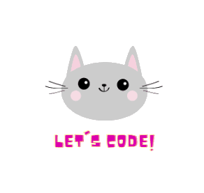

<p align="center" border-radius= "15">
  
   
</p>
<p align="center">
<a href="https://github.com/Nessrine88">
  
</a>
<a href="https://www.linkedin.com/in/nessrine-macherki-86959196/">
  
</a>
<a href="https://twitter.com/Nessour88">
  
</a>
</p>
<p align="center">

</p>

<h2>
A little bit about me :
</h2>

```yaml 
const Macherki Nessrine = {
  lookingFor: "Back-end developer||Front-end developer" || "Full-stack web developer",
  pronouns: ["she", "her"],
  code: [JavaScript,HTML/CSS,Bootstrap,React, Redux, Ruby on Rails],
  askMeAbout: [Cats, food recipes, renovation shows],
  challenge: "I am honing my React skills and picking up TypeScript",
  Study: ['I'am currently completing a coursework at Microverse', ]
  'My tiny cat is ready to meow at the right offer.']}
 ```

 <h2> 🚀 &nbsp;Some Tools I Have Used and Learned</h2>
<div align="left">
  <br>


 


</div> 


<br> <br>


<div align="left">
  
 [](https://git.io/streak-stats)

</div>


<h2> ✍️ Favorite quote</h2>
<div  background-color="black"; color="white">
And be patient! Certainly Allah does not discount the reward of the good-doers.
  _Ayah Hud (Hud) 11:115

  </div>
<h2>🏆 GitHub Trophies</h2>

  [](https://github.com/ryo-ma/github-profile-trophy)
  
<h2>👀 Thanks for exploring! You're visitor number:</h2>


