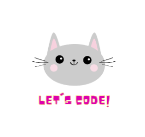

<p align="center">
  
   

</p>


<p align="center">
   
<a href="https://github.com/Nessrine88">
  
</a>
<a href="https://www.linkedin.com/in/nessrine-macherki-86959196/">
  
</a>
<a href="https://twitter.com/Nessour88">
  
</a>
</p>

<p align="center">

</p>

<h2>
A little bit about me :
</h2>

```yaml 
const Macherki Nessrine = {
  lookingFor: "Back-end developer||Front-end developer" || "Full-stack web developer",
  pronouns: ["she", "her"],
  code: [JavaScript,HTML/CSS,Bootstrap],
  askMeAbout: [Cats, food recipes, renovation shows],
  challenge: "I am honing my React skills and picking up TypeScript",
  Study: ['I'am currently completing a coursework at Microverse', ]
  'My tiny cat is ready to meow at the right offer.']}
 ```

 <h2> 🚀 &nbsp;Some Tools I Have Used and Learned</h2>
<p align="left">


  
</p>


<div align="center">
  
  
  
</div>

<div align="center">
  
 [](https://git.io/streak-stats)

</div>
<h2> ✍️ Favorite quote</h2>
<div  background-color="black"; color="white">
 I do not enlighten those who are not eager to learn, nor arouse
those who are not anxious to give an explanation themselves. If I
have presented one corner of the square and they cannot come
back to me with the other three, I should not go over the points
again.
― Confucius
  </div>
  

=======
